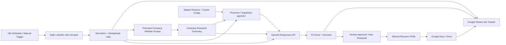

# Architecture

## High-Level System

## Core Design

The system is an agentic workflow, but it should be built as deterministic orchestration plus bounded AI decisions.

n8n coordinates the pipeline. Apify and Firecrawl collect external data. OpenAI performs structured reasoning and writing. Pinecone or Supabase stores searchable context. Google Sheets acts as the control plane and audit log. Google Docs stores generated resumes.

## Component Responsibilities

### n8n

- Runs schedules and manual triggers.
- Calls Apify to scrape jobs.
- Calls Firecrawl to enrich companies.
- Calls OpenAI for relevance scoring and resume generation.
- Writes to Google Sheets.
- Creates Google Docs.
- Routes jobs through approval states.
- Handles retries and duplicate prevention.

### Apify

- Scrapes LinkedIn job postings.
- Returns job title, company, location, description, apply URL, salary, work type, posting date, and company URL where available.
- Should be run with limits and search filters to control cost and quality.

Apify supports n8n through its integration, including running Actors and retrieving dataset items.

### Firecrawl

- Scrapes or crawls the target company website.
- Produces clean markdown or structured data suitable for LLM enrichment.
- Should be limited to key pages such as homepage, about, careers, product, pricing, customers, and blog pages.

Firecrawl supports n8n through a verified node and API operations for scraping, crawling, and structured extraction.

### OpenAI

Use OpenAI for:

- job relevance scoring;
- skill gap analysis;
- keyword extraction;
- company signal extraction;
- tailored resume generation;
- cover letter generation if added later.

Prefer the Responses API with Structured Outputs for reliability. Keep the model configurable. If following the original tutorial exactly, use GPT-4o. For current production quality, use the latest suitable model available in your account.

### Pinecone Or Supabase

Use vector storage for:

- master resume chunks;
- career achievements;
- project stories;
- job descriptions;
- company research;
- generated application artifacts.

Recommended metadata:

- `type`: resume_chunk, job_description, company_page, generated_resume
- `job_id`
- `company_name`
- `role_title`
- `source_url`
- `created_at`
- `status`

### Google Sheets

Acts as the job application database.

Tracks:

- job details;
- fit score;
- application status;
- generated document links;
- review notes;
- duplicate detection keys;
- timestamps.

### Google Docs

Stores the generated tailored resume for each approved job.

The cleanest n8n approach is:

1. Generate structured resume JSON and HTML.
2. Create a Google Doc.
3. Insert or update content.
4. Store the document URL in Google Sheets.

For high-fidelity formatting, use a template document or Google Docs API batch updates.

## Workflow Boundaries

### Workflow 1: Job Discovery

1. Scheduled trigger.
2. Run Apify LinkedIn Jobs Scraper.
3. Fetch dataset items.
4. Normalize job records.
5. Deduplicate by company, title, location, and job URL.
6. Append or update rows in Google Sheets.
7. Send accepted jobs to enrichment.

### Workflow 2: Company Enrichment

1. Receive job record.
2. Resolve company website.
3. Firecrawl scrape/crawl company site.
4. Summarize company mission, products, customers, values, technical signals, and hiring clues.
5. Store research in vector DB.
6. Update Google Sheets.

### Workflow 3: Relevance And Resume

1. Load master resume/career profile.
2. Retrieve relevant resume chunks and company context from vector DB.
3. Use OpenAI structured output to score fit.
4. If score is below threshold, mark rejected.
5. If score is above threshold, generate tailored resume HTML.
6. Create Google Doc.
7. Update Google Sheets with score, rationale, and document URL.

## Human Approval Gate

Default policy:

- score below 65: reject
- score 65 to 79: needs review
- score 80 and above: generate resume
- auto-apply: disabled by default

The system prepares strong applications; the user remains in control of actual submission.

## Security And Compliance

- Respect website terms and robots policies.
- Avoid scraping behind logins unless permitted.
- Store API keys only in n8n credentials.
- Do not upload sensitive personal data to unnecessary systems.
- Keep a master resume source of truth.
- Keep generated resumes auditable.
- Avoid fabricating skills, roles, dates, credentials, employers, or achievements.

## Reliability

Use idempotency keys:

- `job_url_hash`
- `company_name + role_title + location`
- `apify_actor_run_id + dataset_item_id`

Use retry and dead-letter paths for:

- Apify failures;
- Firecrawl crawl failures;
- OpenAI schema failures;
- Google Docs creation failures;
- Google Sheets update conflicts.

